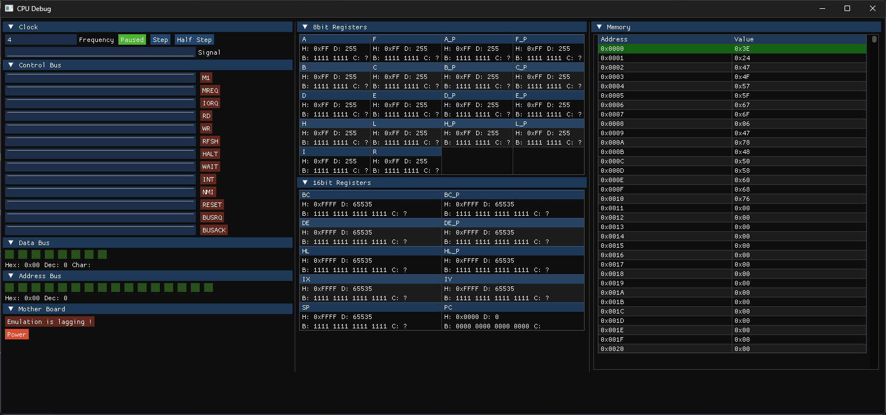

# z80emu

A naive attempt at emulating a z80 based on the user manual in doc.



## Cloning

```shell
git clone git@github.com:Tomobodo/z80emu.git
```

## Building

The project uses CMake FetchContent to automatically download and build dependencies.

It has been developed and tested with Clang on Windows.

Not tested on other platforms or compilers yet.

### Requirements

- cmake > 3.25
- A C++23 compatible compiler (MSVC 2022, Clang 15+, or GCC 12+)
- Git (for FetchContent to download dependencies)

### Build steps

CMake will automatically download SDL3, ImGui and doctest using FetchContent:

```shell
cmake -B build
cmake --build build
./build/Debug/z80emu.exe path/to/binary
```

### Dependencies

The following dependencies are automatically managed by CMake FetchContent:

- **SDL3** (3.2.14): Cross-platform multimedia library
- **ImGui** (1.91.9b): Immediate mode GUI library for the debug interface
- **doctest** (2.4.11): unit testing

Their should be no need for manual dependency installation.

## Testing

The project includes unit tests written with doctest framework.

### Building test programs

The assembly test programs are compiled automatically when building the project.
You need make and sjasmplus installed and available in your PATH.

### Building tests

Tests are built automatically when you build the project:

```shell
cmake --build build
```

This will create the test executable `emuz80_tests.exe` in the `build/Debug/tests/` directory.

### Running unit tests

To run all unit tests:

```shell
./build/Debug/tests/emuz80_tests.exe
```

You can also use CMake's test runner:

```shell
cd build
ctest
```

For more verbose output:

```shell
./build/Debug/tests/emuz80_tests.exe -v
```

For running specific test cases, you can use doctest's filtering options:

```shell
./build/Debug/tests/emuz80_tests.exe --test-case="*load*"
```
